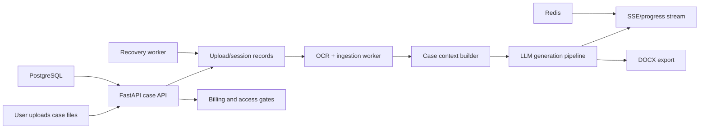

# AI Judge Assistant

[](https://github.com/teran-netizen/ai-judge-assistant/actions/workflows/ci.yml)

Portfolio source snapshot for an AI-native legal document assistant originally built as a Russian-language legal-tech product.

The system turns large case-file uploads into draft legal documents using OCR, retrieval/context assembly, LLM generation, citations, streaming progress, `.docx` export, billing gates, and background recovery workers.

This repository is a sanitized public release for portfolio and technical review. It excludes production secrets, user uploads, database dumps, server backups, SEO exports, and deployment-specific infrastructure.

## Fast Review Path

If you are reviewing this for an AI product, engineering, or developer-experience role:

- Start with the [case study](docs/CASE_STUDY.md) for product context, tradeoffs, and lessons learned.
- Review the ingestion/generation path in `app/services/ingest.py`, `app/services/generate_from_context.py`, and `app/workers/generation_worker.py`.
- Review long-running progress delivery in `app/services/redis_stream.py` and the frontend case workflow in `frontend/src/pages/CasePage.jsx`.
- Review security and operational patterns in `app/middleware/security.py`, `app/utils/auth.py`, `docs/security.md`, and `tests/`.
- Review schema evolution in `alembic/versions/`.

## What It Shows

- Upload-heavy case workflow for hundreds of files per legal matter.
- Async OCR and document ingestion pipeline.
- Case context building, reference extraction, and generation orchestration.
- DeepSeek-compatible LLM service layer with streaming output.
- Background workers for generation, recovery, reconciliation, and job state.
- PostgreSQL schema managed with Alembic migrations.
- Redis-backed event/progress flow for long-running tasks.
- React/Vite frontend for case management, auth, billing, and generation UX.
- Security-minded patterns: rate limits, auth helpers, webhook validation, upload/session controls, and tests.

## Stack

- Backend: FastAPI, SQLAlchemy, Alembic, PostgreSQL, Redis, arq workers.
- Frontend: React 18, Vite, Tailwind, React Router, lucide-react.
- AI/OCR: DeepSeek-compatible API layer, OCR integration points.
- Documents: `.docx` export pipeline.
- Infra: Docker Compose for local review, Nginx frontend container.

## Architecture



## Repository Layout

```text
app/                 FastAPI app, API routers, services, workers, schemas, models
alembic/             Database migrations
frontend/src/        React application source
frontend/public/img/ Public visual assets kept for UI context
tests/               Backend tests and smoke/security checks
docs/                Architecture, security, setup, and pipeline notes
deploy/fail2ban/     Example deployment hardening config
```

## Local Review

1. Copy the environment template.

```bash
cp .env.example .env
```

2. Fill at least `SECRET_KEY`. LLM/OCR/payment integrations stay disabled until their keys are provided.

3. Start the stack.

```bash
docker compose up --build
```

4. Open:

- Frontend: `http://localhost:8080`
- API health: `http://localhost:8000/health`

## Development Without Docker

Backend:

```bash
python -m venv .venv
source .venv/bin/activate
pip install -r requirements-dev.txt
uvicorn app.main:app --reload
```

Frontend:

```bash
cd frontend
npm install
npm run dev
```

## Notes For Reviewers

- Production `.env`, uploads, backups, SQL dumps, and generated SEO pages are intentionally absent.
- Public release uses placeholder payment/OAuth/OCR settings.
- Legal output must be reviewed by a qualified professional; this project is not legal advice.
- The most relevant code for AI product review is in `app/services/`, `app/workers/`, `app/api/cases.py`, and `frontend/src/`.

## Portfolio Context

This project is useful as a case study for AI product, developer experience, and agentic workflow roles because it combines product requirements, long-running background tasks, context engineering, LLM cost/reliability concerns, document generation, and real launch constraints in one product.

See [docs/CASE_STUDY.md](docs/CASE_STUDY.md) for the narrative version: what problem the system solved, the design decisions behind it, and what I would improve next.
