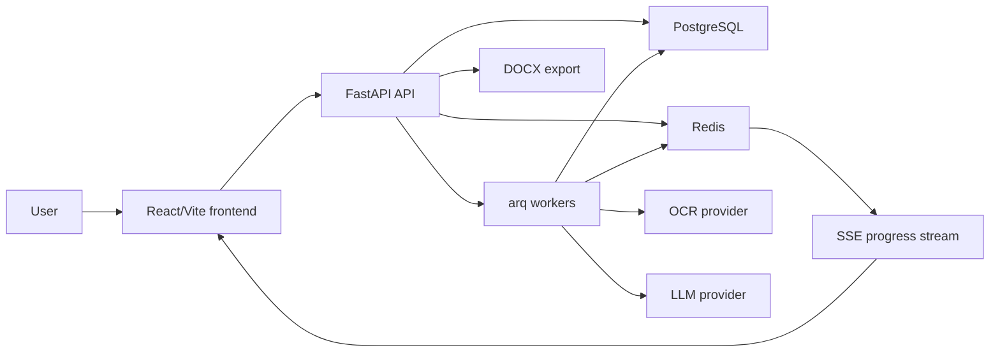

# Architecture

This document describes the public, sanitized architecture of AI Judge Assistant. It intentionally avoids production hostnames, server paths, backup details, and user data.

## System Overview

AI Judge Assistant is built around long-running document-processing jobs. The HTTP API accepts case files and user actions, while background workers handle OCR, fact extraction, case-context assembly, LLM generation, recovery, and reconciliation.



## Main Components

| Layer | Role |
| --- | --- |
| Frontend | React SPA for auth, case upload, progress, generation results, billing, and admin views. |
| API | FastAPI application with auth, case lifecycle, billing, assistants, activity, and admin routers. |
| Workers | arq workers for OCR, extraction, generation, recovery, and reconciliation. |
| Database | PostgreSQL schema managed by Alembic migrations. |
| Redis | Job queue, distributed locks, refresh-token state, and progress-stream state. |
| AI/OCR | Provider-facing service modules isolate OCR and LLM calls from API routes. |
| Export | DOCX generation for editable legal-document output. |

## Backend Map

```text
app/
  api/          HTTP routers: auth, cases, billing, assistants, admin, activity
  services/     OCR, ingestion, generation, streams, payments, DOCX export
  workers/      long-running background jobs and recovery loops
  models/       SQLAlchemy models
  schemas/      Pydantic schemas
  middleware/   security headers and request hardening
  utils/        auth, rate limits, dependency helpers, datetime helpers
alembic/        database migrations
tests/          smoke, security, API, and contract tests
```

## Case Processing Flow

1. The user creates a case and uploads files.
2. The API stores metadata and upload/session records.
3. A worker classifies files and chooses OCR/text paths.
4. Extracted text is normalized into case context.
5. Generation runs through the LLM service layer.
6. Progress is written to Redis and delivered to the frontend through SSE.
7. The user can refine the result and export it as `.docx`.

## Reliability Patterns

- Long-running work is moved out of HTTP requests and into workers.
- Redis-backed progress state lets the frontend reconnect and catch up.
- Worker heartbeat/recovery code handles interrupted generation jobs.
- Alembic migrations document schema evolution across product changes.
- Upload/session state supports large files and resumable flows.

## Security Patterns

- HttpOnly cookie authentication with refresh-token fallback.
- OAuth state/PKCE protection.
- Redis-backed rate limiting on sensitive endpoints.
- Security middleware for headers and request hardening.
- Payment/webhook validation patterns covered by tests.
- Production secrets, uploads, dumps, and backups are excluded from this portfolio snapshot.

## Review Pointers

- `app/services/ingest.py` - file classification, OCR/extraction, summary flow.
- `app/services/generate_from_context.py` - final generation and usage tracking.
- `app/services/redis_stream.py` - progress streaming and reconnect behavior.
- `app/workers/generation_worker.py` - worker orchestration.
- `app/api/cases.py` - case lifecycle API.
- `frontend/src/pages/CasePage.jsx` - primary user workflow.
